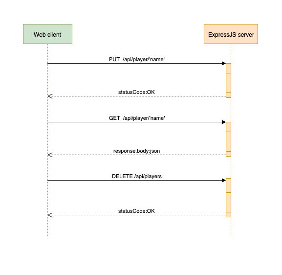

## Node-service (under development)
An ExpressJS server that provides an AngularJS web client. It calls the api endpoints in a `springboot-service`, displaying it as a list in HTML. As such, it essentially works as a proxy server, making the `springboot-service` available.
The ExpressJS server exposes the following endopoints,

```
/api/load_player/:name
/api/get_player/:name
/api/get_players
```
### Request layout


### Debug
Accessing the node debugger on the ExpressJS server can be done with,
```
$ kubectl exec -it {depl-name} bash
$ node inspect server.js
```

### Log
Accessing the node log on the ExpressJS server can be done with,
```
$ kubectl exec -it {depl-name} bash
$ tail -f /tmp/node.log
```

Ideally it should be implemented with [log4js](https://github.com/log4js-node/log4js-node).

### Docker
Building and deploying a docker image is done with,
```
$ ./deploy.sh
```


