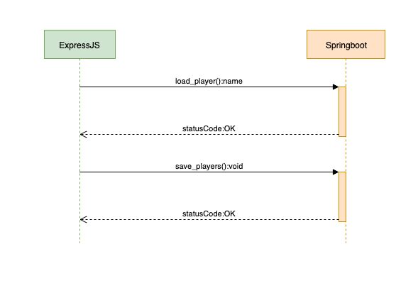

## Springboot-service (under development)
A Spring Boot Server that exposes the following endpoints,
```
/api/load_player
/api/load_players
/api/get_player
/api/get_players
/api/save_players
/api/clear_players
```

It calls a REST API that return player statistics and currently saves the data in a `List`.

### Request layout

