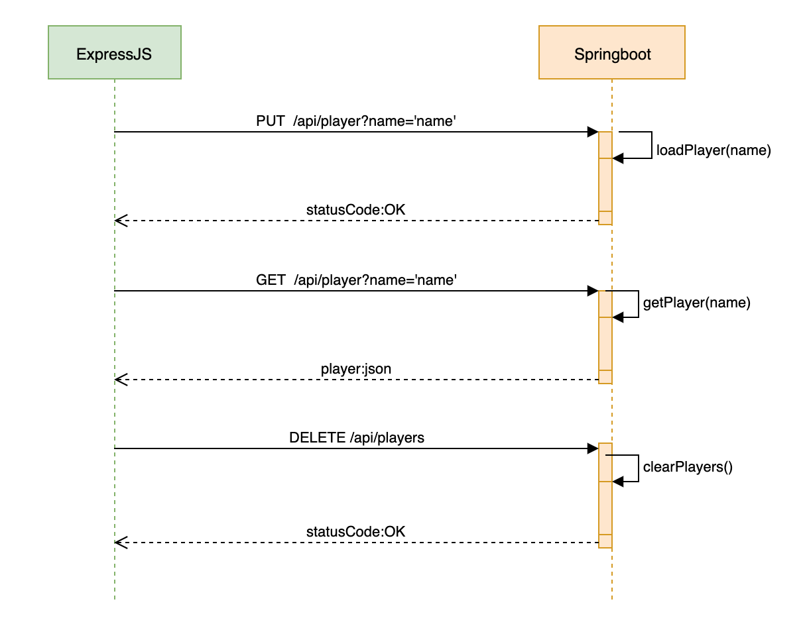

## Springboot-service (under development)
A Spring Boot Server that exposes the following endpoints,
```
// PUT
api/player
HTTP/1.1 200
Content-Length: 13
Content-Type: text/plain;charset=UTF-8
Content : "Player loaded"

// GET
api/player
HTTP/1.1 200
Content-Type: application/json;charset=UTF-8
Transfer-Encoding: chunked
Content: {
  "country": value,
  "game": value,
  "name": value,
  "rank": value
}
```

It calls a REST API that return player statistics and currently saves the data in a `List`. The general structure of this project is taken from Skatteetaten's [openshift reference application](https://github.com/Skatteetaten/openshift-reference-springboot-server).

### Request layout


### Log

### Docker
Building and deploying a docker image is done with,
```
$ ./deploy.sh
```
